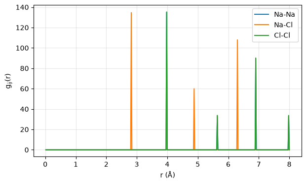
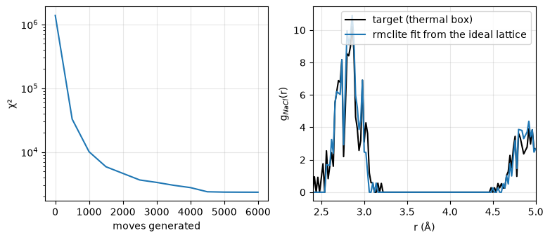
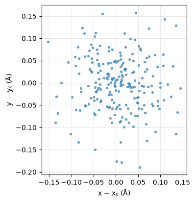
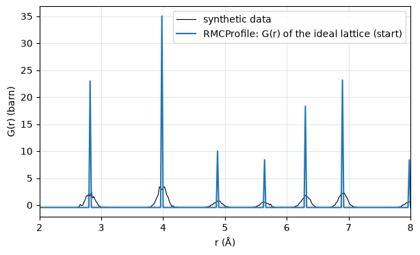
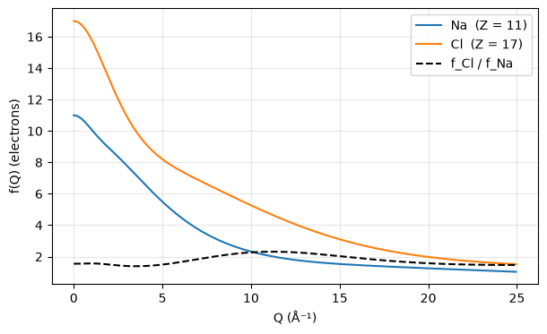
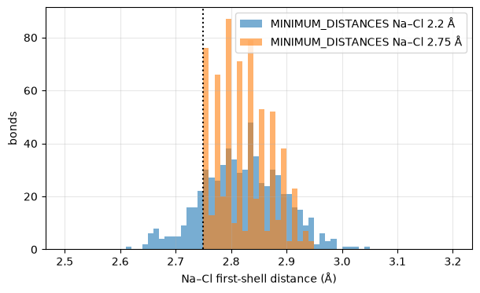
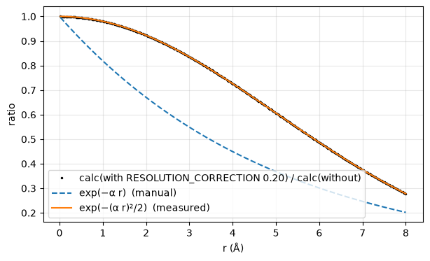
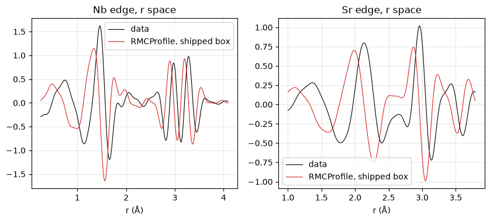
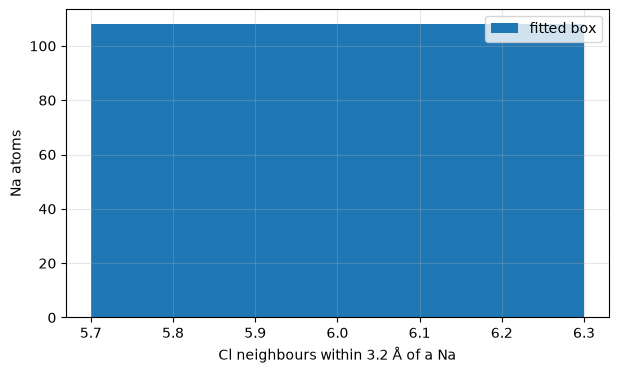

# rmcprofile-skill

An AI-agent skill and verified Python toolkit for
[RMCProfile](https://rmcprofile.ornl.gov/), the Reverse Monte Carlo program
for total scattering — with executed chapter notebooks and an undergraduate
course to follow in later releases.

RMCProfile itself is not included: download it from the RMCProfile site,
unpack it, and set `RMCPROFILE_HOME` to its `RMCProfile_package` directory.
Everything here that does not need the binary works without it.

## What it does

- **Drive** an RMCProfile 6.7.9 installation: read and write every input
  format (`.dat` keyword blocks, `.rmc6f` configurations, data files, the
  Bragg family, `.dw`), check an input set for the mistakes the manual warns
  about (and two it does not: the silent `.poly` wait and the exit-code-0
  stop), run the binary with the environment its setup script would set, and
  parse every output (χ² history, fit CSVs, partials).
- **Analyse** configurations without the binary: partial g(r), Keen's G(r)
  in barn, F(Q), coordination numbers, bond-angle distributions, the average
  cell — validated on exact geometry and on the identity
  G(r→0) = −(Σ c_i b_i)² that the package's own SF6 data reproduces.
- **Cross-check** itself against the installed package: stage any shipped
  exercise, run it, and compare our partials and G(r) with RMCProfile's own
  CSVs to recorded tolerances.
- **Teach** with `rmclite`, a clean-room Reverse Monte Carlo engine whose
  calculated functions equal RMCProfile's by construction: moves, χ² terms,
  constraints, a bond potential, Metropolis acceptance — small enough to read.
  The chapters (one per data type the program fits) and the course follow.

## Install

```
scripts\install_rmcprofile_windows.ps1        # Windows: conda env `rmcprofile` + kernel; -DryRun first
bash scripts/install_rmcprofile.sh            # Linux / macOS / WSL; --dry-run first
export RMCPROFILE_HOME=/path/to/RMCProfile_package    # the directory with exe/ and tutorial/
python scripts/verify_rmcprofile.py           # five checks, exit 0 only when all pass
```

`docs/USER_MANUAL.md` has the full walk-through; `AGENTS.md` the contract
for agents; `SKILL.md` the workflows.

## Quick start

```
python scripts/verify_rmcprofile.py                                   # environment + physics + package smoke test
python scripts/rmcprofile_tools.py check  sf6 --dir runs/sf6          # findings, exit 1 on any ERROR
python scripts/rmcprofile_tools.py run    sf6 --dir runs/sf6 --timeout 10
python scripts/rmcprofile_tools.py pdf    runs/sf6/sf6.rmc6f --rmax 8 --outdir out
python scripts/rmcprofile_tools.py coord  runs/sf6/sf6.rmc6f --pair S F --rmax 2.0
python scripts/rmcprofile_tools.py angles runs/sf6/sf6.rmc6f --triplet S F F --rmax 2.0
python scripts/upstream_adapter.py crosscheck ex_1 --timeout 3            # our partials vs the package's, to tolerance
python scripts/rmclite.py synth truth.rmc6f --displace 0.05 --rmax 5 --outdir out
python scripts/rmclite.py fit average.rmc6f --target out/truth_target_PDFpartials.csv --moves 3000 --outdir out
```

## What is verified

- Suite of 255 tests (`python -m pytest tests -q`) plus the 117 `check(...)` lines of the eleven chapters, pyflakes clean; the
  package-bound tests (real smoke test, layout) skip without
  `RMCPROFILE_HOME` and pass with either build.
- Both 6.7.9 builds installed and every shipped tutorial exercise run from
  pristine copies on Windows (CUDA build) and WSL Ubuntu (CPU build). The
  deterministic passes (`TIME_LIMIT 0`) print identical χ²/dof on both:
  SF6 0.4201, SF6 10×10×10 3.915, GaPO4 X-ray 252.5. The smoke test takes
  2–6 s.
- The Keen identity for SF6: our neutron weights give G(0) = −0.2759 barn,
  the value at which the package's own G(r) data file starts.
- On RMCProfile's r grid (r_k = k·dr, bins centred on r_k) our partials equal
  the package's `_PDFpartials.csv` to 2.8e-4 (its single precision) and our
  G(r) its `PDF1 (RMC)` column to 3e-5 barn, on both builds — the cross-check
  adapter asserts this against `tests/records/crosscheck_v1.json`.
- `rmclite`: incremental histograms bit-equal to a rebuild, constraints never
  violated, seeds reproduce, a harmonic bond thermalises to 0.78 k_BT/k, and a
  fit from the average structure cuts χ² by four orders of magnitude while
  reproducing the pair distribution rather than the coordinates.
- Formats round-trip on synthetic fixtures and were corrected against the
  real files the package writes (see `references/pitfalls.md`).

## The book

Eleven executed notebooks in [`chapters/`](chapters/README.md) — §1–40, from
the pair distribution function to a refined box, every number computed in
the notebook and checked against a known answer. One figure per chapter:

<!-- gallery:start -->

**[Total scattering and the pair distribution function](chapters/RMCProfile_01_Total_Scattering_and_the_PDF.ipynb)**



*Partial pair distribution functions of the ideal NaCl lattice: every interatomic distance is a delta function on RMCProfile's r grid. The first Na–Cl shell sits at a/2 = 2.82 Å, the first Na–Na and Cl–Cl shells at a/√2 = 3.99 Å.*

**[The Reverse Monte Carlo algorithm](chapters/RMCProfile_02_The_RMC_Algorithm.ipynb)**



*Left: χ² against generated moves for a fit from the ideal NaCl lattice toward the partials of a thermally displaced box. Right: the Na–Cl partial of the fit against its target after 6000 moves.*

**[Starting configurations and the rmc6f file](chapters/RMCProfile_03_Starting_Configurations.ipynb)**



*The 216 Sr atoms of the thermal SrTiO₃ box folded back into one unit cell and projected on the ab plane: a Gaussian cloud around the site whose width is the displacement amplitude put in (0.06 Å per coordinate).*

**[Fitting neutron F(Q) and G(r) with RMCProfile](chapters/RMCProfile_04_Fitting_Neutron_Data.ipynb)**



*Before any move: the synthetic G(r) 'data' (thermal box plus noise) against RMCProfile's calculated G(r) of the ideal-lattice starting box, read back from its _PDF1.csv. The delta-sharp lattice peaks must broaden into the data's.*

**[X-ray data and the Bragg profile](chapters/RMCProfile_05_Xray_and_Bragg.ipynb)**



*X-ray atomic form factors of Na and Cl from the Cromer–Mann tables: Z electrons at Q = 0, falling with Q; the ratio between them is not constant, so an X-ray F(Q) mixes the partials with Q-dependent weights.*

**[Constraints, restraints and potentials](chapters/RMCProfile_06_Constraints_and_Potentials.ipynb)**



*The Na–Cl first-shell distances of two refined boxes: with the closest approach at 2.2 Å the thermal shell is reproduced on both sides of 2.82 Å; with it at 2.75 Å (dotted) no bond can be shorter, and the distribution is cut off there.*

**[Corrections: resolution, Q-damping and nano-size](chapters/RMCProfile_07_Corrections.ipynb)**



*The damping RMCProfile applies for RESOLUTION_CORRECTION 0.20, measured as the ratio of two calculated G(r) columns of the same box: a Gaussian in r, not the exponential the manual writes.*

**[Magnetic, EXAFS and diffuse scattering](chapters/RMCProfile_08_Magnetic_EXAFS_Diffuse.ipynb)**



*The two EXAFS edges of the package's SnO exercise (Nb and Sr absorbers) in r space: RMCProfile's calculation for the shipped starting configuration, evaluated with no moves. The exercise's measured χ(r) is not reproduced here (it belongs to the package); the legend gives the calculation's correlation with it.*

**[Analysing configurations](chapters/RMCProfile_09_Analysing_Configurations.ipynb)**



*Left: the running coordination number of Na — Cl neighbours within a cutoff radius, averaged over the 108 Na atoms — for the refined box and the truth: a plateau at 6 across the whole first shell (the histogram at 3.2 Å is a single bar, 6 : 108), the step to 14 at the next Cl shell (4.88 Å) and the rise into the 24 at 6.3 Å. Right: the first-shell bond-length distribution, r²-weighted from the Na–Cl partial, with its mean and width for both boxes.*

<!-- gallery:end -->

## The course

Eleven lectures on the book, in [`course/`](course/README.md): a flat
reveal.js deck (`course/deck/index.html`), the same deck as a PDF
(`course/slides.pdf`), an A4 handout and lecturer notes. Every one of the 24
chapter figures appears under its full notebook caption; every number on a
slide was printed by a chapter cell.

## Honest comparison with neighbours

| If you want… | Use | Why not this |
|---|---|---|
| The program itself — fits of neutron and X-ray total scattering, Bragg profiles, EXAFS, magnetic and diffuse data | [RMCProfile](https://rmcprofile.ornl.gov/) 6.7.9 (closed-source, "AS IS and for non-profit making purposes") | This project drives a copy you install and contains nothing from it; it is the checker, the cross-check, the book and the course *around* the program, not a replacement. |
| RMCProfile's own Python side tools | `rmc_tools`, `sofq_calib`, `topas4rmc` on conda channel `apw247` (GPL-2) | They are pinned to Python 3.7 and two are GUIs; `rmc_tools`' rmc6f reader agrees with ours on every shipped configuration and crashes on boxes under 100 atoms. This toolkit is a library with tests, on current Python, and reads both rmc6f layouts. |
| A scriptable RMC engine to run real refinements | [fullrmc](https://github.com/bachiraoun/fullrmc) (AGPL-3.0) | `rmclite` is a teaching engine at ~1 900 moves/s on 64 atoms, built to be read and to equal RMCProfile's functions; fullrmc is built to be run, with a modular constraint system, but no Bragg-profile fitting. |
| The small-box view of the same PDF data | [PDFgui / diffpy-CMI](https://github.com/diffpy) (BSD) | A handful of average-structure parameters instead of thousands of coordinates; this book's chapters 3 and 7 say when that stops being enough and reuse PDFgui's names (`Qdamp`, `Qbroad`) for the corrections it measures. |
| Diffuse scattering from disordered crystals, or liquids and glasses with empirical potentials | [DISCUS](https://github.com/tproffen/DiffuseCode), [Dissolve](https://github.com/disorderedmaterials/dissolve) (GPL-3.0) | Different routes to disorder (simulation and refinement, EPSR); RMCProfile ships an export to DISCUS. |
| Reduction from raw scattering to F(Q) and G(r) | [ADDIE](https://github.com/neutrons/addie), Mantid, GudrunN/X, PDFgetX3 | This project synthesises its data with a known answer; it produces no reduced data and reads whatever those tools write in RMCProfile's conventions. |

## Roadmap

The 6.8.0 release candidate through the cross-check, more exercises in the
cross-check records, EXAFS χ(k) parsing, an F(Q) cross-check.

## How it was built

Written with Claude Code (Claude Fable 5.1) on 2026-09-04 and 2026-09-05 in a study repository
that also holds the website survey, the package audit on both builds, the findings ledger
(P-1..P-21), the GPL-tools audit, the literature run and the drafts for the mailing list: a
foundation release (formats, checker, runner, analysis), a cross-check and teaching-engine
release, the eleven-chapter book, the course, and the weekly watch — five plans executed inline,
each merged and packed, then the publication pass. Effort ≈ 2 working days in one long session;
the full transcript is kept by the author and available on request.

| Role (CRediT) | Fabio Campolim | Claude |
|---|---|---|
| Conceptualization — the project ("a skill for RMCProfile the same way as kwant, pythtb, memristec"), the study-and-contribute shape, the clean-room rule | ● | ○ |
| Methodology — the check-everything contract, the synthetic-truth design, measuring the program against its manual | ● | ● |
| Software — toolkit, checker, runner, adapter, rmclite, notebook and course build tooling, watch script, tests | ○ | ● |
| Validation — every chapter check, the cross-checks on both builds, the re-executions, CI | ○ | ● |
| Investigation — package audit, upstream findings, GPL-tools audit, literature run, website survey | ○ | ● |
| Writing – original draft — chapters, course, manual, references, drafts | ○ | ● |
| Writing – review & editing — the decisions at every gate (admission, folder name, spec approval, "inline", "pin mine, go with all", "go public"), the figure and README review | ● | ○ |
| Resources — the machine, both RMCProfile builds, the credentials; and the actions only a person may take (mailing list, sending drafts) | ● | ○ |

CRediT is a taxonomy for human contributors; the author is the sole author of record and the
table is the disclosure of what the assistant did.

## Licence

Apache-2.0 — see `LICENSE` and `NOTICE`.

### Disclaimer

This software is provided "as is", without warranties or conditions of any
kind, express or implied, including but not limited to merchantability, fitness
for a particular purpose and non-infringement. In no event shall the authors be
liable for any claim, damages or other liability arising from its use.
This project is independent and not affiliated with or endorsed by the
RMCProfile developers, Oak Ridge National Laboratory, ISIS/STFC, NIST or the
universities named in `NOTICE`. RMCProfile is distributed by its authors under
their own terms ("AS IS and for non-profit making purposes"); this project
does not redistribute it.

## Citation

`CITATION.cff`. Cite RMCProfile itself as Tucker et al., *J. Phys.: Condens.
Matter* 19 (2007) 335218 and Zhang et al., *J. Appl. Cryst.* 53 (2020) 1509.
